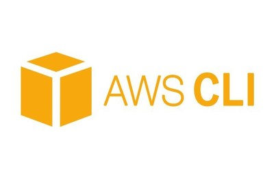

# Technologies used:
* Shutdown Database to minimize costs.

# AWS RDS Terraform Configuration
This is a Terraform configuration to provision an RDS database instance in AWS with MySQL engine version 8.0.
# Prerequisites
To use this configuration, you should have the following:
# An AWS account
- Terraform installed on your local machine.
- AWS CLI installed on your local machine.
- An AWS CLI profile set up.
# Usage
1. Clone this repository to your local machine.
2. Navigate to the cloned repository directory using the terminal.
3. Run terraform init to initialize the working directory.
4. Run terraform apply to create the resources defined in the configuration.
5. Wait for Terraform to complete the resource creation process. This may take a few minutes.
6. Once the resources are created, you can connect to the RDS instance using a MySQL client of your choice. The           credentials are specified in the Terraform configuration file.
7. You can execute SQL commands using your client of choice. An example of SQL commands are provided in the Terraform configuration file.
# Terraform Resources
1. aws_db_parameter_group
- This resource creates a new database parameter group with default MySQL 8.0 settings.
2. aws_db_instance
- This resource creates an RDS database instance with the following configuration:
- MySQL 8.0 engine
- db.t3.micro instance class
- 20 GB allocated storage with gp2 storage type
- default parameter group
- Skips final snapshot when the instance is deleted
- Availability Zone set to us-east-1a
- Publicly accessible
# SQL Commands
- The following SQL commands are provided in the Terraform configuration file for reference:
- Creates a table named "customers" with columns "id", "name", and "email"
- Inserts a new record into the "customers" table
- Retrieves all records from the "customers" table
- Updates a record in the "customers" table
- Deletes a record from the "customers" table
# Notes
- This configuration is for demonstration purposes only and is not intended for production use without further customization and hardening.
- Be sure to properly configure the security settings and access control for your RDS instance to avoid exposing sensitive data.
